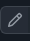

# WOSO Chart
The ultimate women's soccer relationship chart

## Contributing
Contributing information to the chart is easy, even if you don't know how to code, or how to use GitHub. There are two ways you can contribute:

### Method 1: Beginner
Open a new [Issue](https://github.com/wosochart/TheWosoChart/issues/new/choose) describing what you want changed. 

### Method 2: Advanced
If you want to add the data yourself, you can follow these instructions to create what is called a Pull Request. A Pull Request is suggested changes which will either by Approved or Denied by the owner of this repository. Follow the instructions carefully to ensure that your changes will be accepted

- First you will need to create a GitHub account. 
- Next you will have to click the [Fork Button](https://github.com/wosochart/TheWosoChart/fork) at the top.
- Once you have forked a copy of the project into your account, you can edit the player's data by 
    1. opening `players.json` and clicking the  at the top of the page.
    2. After you have made your changes, select .
    3. Finally go back to the [parent repository](https://github.com/wosochart/TheWosoChart) and select 

    The process is the same for editing `relationships.json`

## Relationship Color Scheme
It is important to adhere to the data format when contributing, so that the output of the program is correct. Relationship color scheme is as follows:

- `"label": "Gf", "color": "6aa84f"`
- `"label": "Ex", "color": "ff0000"`
- `"label": "Wife", "color": "9cc2e5"`

When adding missing players to `players.json` you can add the corresponding image to `/img` folder. Be sure to follow the player data format of the existing data.